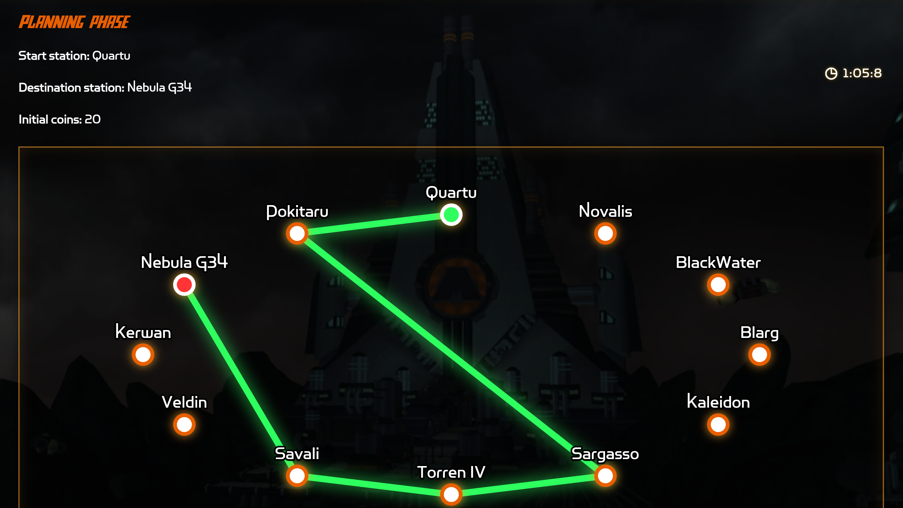
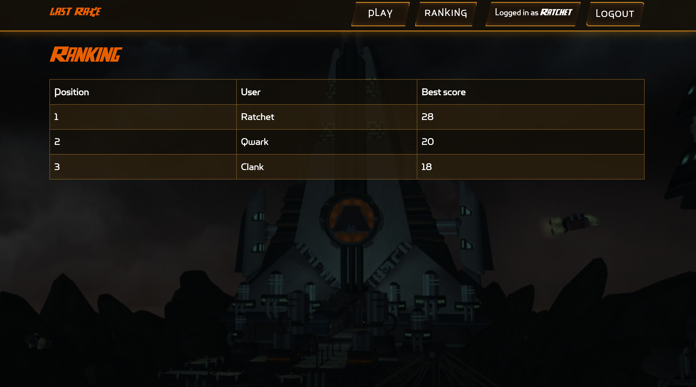

# Exam #N: "Last Race"
## Student: s360284 CENTRELLA ANDREA

## React Client Application Routes

- Route `/`
  - Page: `HomePage`
  - Purpose: public homepage of the application. Anonymous users see the game introduction and instructions, while logged-in users see a welcome message and can navigate to the game or ranking pages.

- Route `/login`
  - Page: `Login`
  - Purpose: login page. It allows users to enter their credentials and start an authenticated session.

- Route `/play`
  - Page: `PlayPage`
  - Purpose: protected game page. Only logged-in users can access it. It manages the game flow: game creation, setup map, planning phase, route drawing, timer, route submission, and final result.

- Route `/ranking`
  - Page: `RankingPage`
  - Purpose: protected ranking page. Only logged-in users can access it. It displays the best score achieved by each user.

## API Server

### Authentication APIs

- POST `/api/sessions`
  - Request body:
    ```json
    {
      "username": "Ratchet",
      "password": "lombax"
    }
    ```
  - Response body:
    ```json
    {
      "id": 1,
      "username": "Ratchet"
    }
    ```
  - Description: logs in a user using Passport.js and creates a session cookie.

- GET `/api/sessions/current`
  - Request parameters: none.
  - Response body:
    ```json
    {
      "id": 1,
      "username": "Ratchet"
    }
    ```
  - Description: returns the currently authenticated user if a valid session exists.

- DELETE `/api/sessions/current`
  - Request parameters: none.
  - Response body: none.
  - Description: logs out the current user and destroys the session.

### Network APIs

- GET `/api/network/full`
  - Request parameters: none.
  - Response body:
    ```json
    {
      "stations": [],
      "lines": [],
      "segments": [],
      "lineStations": []
    }
    ```
  - Description: returns the complete transport network, including stations, lines, physical segments, and ordered stations for each line. It is used to draw the setup map.

- GET `/api/stations`
  - Request parameters: none.
  - Response body: list of stations.
  - Description: returns all stations.

- GET `/api/lines`
  - Request parameters: none.
  - Response body: list of lines.
  - Description: returns all lines with their colors.

- GET `/api/segments`
  - Request parameters: none.
  - Response body: list of physical station-to-station segments.
  - Description: returns all available physical connections between stations.

- GET `/api/line-stations`
  - Request parameters: none.
  - Response body: ordered list of stations belonging to each line.
  - Description: returns the line-station associations used to reconstruct colored lines on the setup map.

### Game APIs

- POST `/api/games`
  - Request parameters: none.
  - Request body: none.
  - Response body:
    ```json
    {
      "id": 12
    }
    ```
  - Description: creates a new game for the logged-in user. The server selects a start station and a destination station at least three segments apart, immediately stores them in the `games` table, and creates the game with status `planning`.

- GET `/api/games/:id/planning`
  - Request parameter:
    - `id`: game id.
  - Response body:
    ```json
    {
      "game": {
        "id": 12,
        "startStation": {
          "id": 4,
          "name": "Blarg"
        },
        "destinationStation": {
          "id": 12,
          "name": "Pokitaru"
        },
        "initialCoins": 20,
        "status": "planning"
      },
      "stations": [],
      "segments": []
    }
    ```
  - Description: returns the data needed during the planning phase. The start and destination stations are read from the database, not generated on the client.

- POST `/api/games/:id/route`
  - Request parameter:
    - `id`: game id.
  - Request body:
    ```json
    {
      "segmentIds": [17, 18, 4, 8]
    }
    ```
  - Response body for a valid route:
    ```json
    {
      "valid": true,
      "finalScore": 24,
      "steps": []
    }
    ```
  - Response body for an invalid route:
    ```json
    {
      "valid": false,
      "reason": "Route is not continuous",
      "finalScore": 0,
      "steps": []
    }
    ```
  - Description: submits the route selected by the user. The backend validates the route, executes it only if it is valid, applies random events, stores the execution steps, and completes the game.

- GET `/api/games/:id/result`
  - Request parameter:
    - `id`: game id.
  - Response body:
    ```json
    {
      "game": {
        "id": 12,
        "startStation": {
          "id": 4,
          "name": "Blarg"
        },
        "destinationStation": {
          "id": 12,
          "name": "Pokitaru"
        },
        "initialCoins": 20,
        "finalScore": 24,
        "status": "completed",
        "completedAt": "2026-06-17 10:30:00"
      },
      "steps": [
        {
          "step_order": 1,
          "segment_id": 17,
          "from_station_name": "Blarg",
          "to_station_name": "Kaleidon",
          "event_description": "Golden Bolt",
          "event_icon_filename": "golden-bolt.png",
          "effect": 4,
          "coins_after_step": 24
        }
      ]
    }
    ```
  - Description: returns the final result of a completed game, including the execution steps and the event icons.

### Ranking API

- GET `/api/ranking`
  - Request parameters: none.
  - Response body:
    ```json
    [
      {
        "user_id": 1,
        "username": "Ratchet",
        "best_score": 25
      }
    ]
    ```
  - Description: returns the ranking of logged-in users, considering only the best score of each user.

## Database Tables

- **Table `users`** - contains the registered users of the application. Each user has an `id`, a `username`, and a `password_hash`. The plain password is never stored in the database.

- **Table `stations`** - contains all the stations of the transport network. Each station has an `id` and a `name`.

- **Table `lines`** - contains the metro lines available in the game. Each line has an `id`, a `name`, and a `color`, used by the frontend to draw the setup map.

- **Table `line_stations`** - contains the ordered list of stations belonging to each line. It connects `lines` and `stations` and stores the `position` of each station inside the line.

- **Table `segments`** - contains the physical connections between two stations. Each segment connects `station1_id` and `station2_id`.

- **Table `line_segments`** - connects each line with the physical segments that belong to it. This allows the same segment to be associated with one or more lines if needed.

- **Table `events`** - contains the possible random events that can happen during route execution. Each event has a `description`, an `effect` on the number of coins, and an `icon_filename` used by the frontend to display the corresponding event icon.

- **Table `games`** - contains the games created by logged-in users. Each game stores the user, the start station, the destination station, the initial number of coins, the final score, the game status, and timestamps for creation and completion.

- **Table `game_steps`** - contains the execution steps of a completed game. Each step stores the selected segment, the movement from one station to another, the random event applied, and the number of coins after that step.

## Database Population

- The **SQLite database** - was populated **manually** from the terminal,   inside the **SQLite shell**, SQL INSERT statements were used to populate the initial data, including users, stations, lines, segments, events, and some completed games for the ranking.

- **User passwords** - are not stored in plain text. Before inserting users into the database, passwords were hashed **using bcrypt**. For example, the following Node.js command was used to generate a password hash:

    `node -e "import bcrypt from 'bcrypt'; const hash = await bcrypt.hash('lombax', 10); console.log(hash);`

    The generated hash was then inserted into the password_hash column of the users table. During login, Passport.js receives the plain password entered by the user and verifies it using bcrypt.compare. This function compares the plain password with the stored password_hash and returns whether they match.

## Main React Components

- `App` (in `App.jsx`): main application component. It manages the current logged-in user, checks the current session on page reload, defines the application routes, and protects private pages from anonymous users.

- `NavigationBar` (in `App.jsx`): top navigation bar. It shows the application title, navigation links, the current logged-in user, and the login/logout controls.

- `ProtectedRoute` (in `App.jsx`): wrapper component used to prevent anonymous users from accessing protected pages such as the game page and the ranking page.

- `HomePage` (in `homepage.jsx`): homepage of the application. It shows the game introduction and instructions to anonymous users, and a welcome message to logged-in users.

- `Login` (in `login.jsx`): login form component. It collects username and password, calls the login API, stores the authenticated user in the application state, and redirects the user after login.

- `PlayPage` (in `playpage.jsx`): main game component. It manages the game phases, including setup, planning, route selection, timer, route submission, and result visualization.

- `SetupMap` (in `networkmap.jsx`): map component used during the setup phase. It displays the complete network using the stations, lines, line colors, and line-station ordering coming from the database.

- `PlanningMap` (in `networkmap.jsx`): map component used during the planning phase. It allows the user to draw a route by clicking stations and stores the selected segment ids that will later be validated by the backend.

- `RankingPage` (in `rankingpage.jsx`): ranking page component. It retrieves and displays the best score for each user.

## Screenshot




## Users Credentials

- **Ratchet** — password: `lombax`
- **Clank** — password: `robot`
- **Qwark** — password: `capitano`

## Use of AI Tools

During the development of this project, I used ChatGPT, specifically the GPT-5.5 model, as an AI support tool.

The AI tool was used for the following purposes:

* organizing the development phases of the project;
* discussing and refining backend logic, especially route validation and the efficiency of path-related algorithms;
* supporting frontend development, with heavier use for the user interface, including layout decisions, colors, visual effects, transformations, and animations;
* debugging and improving parts of the code during development;
* improving the wording of the application texts and the README, mainly for clarity, structure, and grammar.

